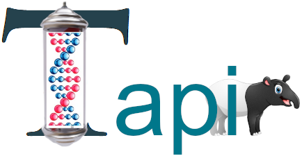

# Tapir

Two-step  
Analysis  
Pipeline for  
Investigative  
Reporting  

## Table of contents

-   for installation instructions.
-   for a quick start.
-   for a list of tools, terms and definitions.
-   Tapir is a two-step; Step 1 is converting raw genomic information (BCL) to a processed alignment file (BAM).
-   After Step1 you (the user) need to evaluate your sample(s). Are they fit for further analysis?
-   Step 2 converts 1 (or more) BAM files into data suitable for upload to GEDmatch.

