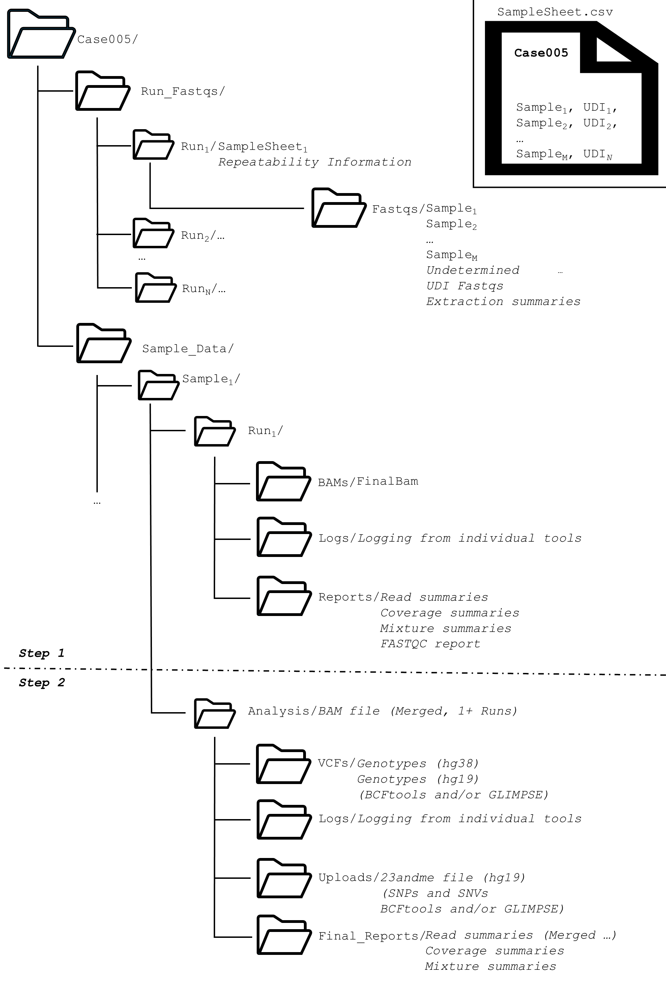

Items in teal are for *user-interpretation*. Items in dark blue are programs and tools. The final result (bam) is depicted in green.

# Step 1
## Quick references
-   for a list of tools, terms and definitions.

## The flow
In words:
-  Raw BCL data (Illumina sequencer) are demultiplex (converted to fastq) by
   -  bcl2fastq (MiSeq, NovaSeq, HiSeq...) **OR**
   -  bcl-convert (NextSeq, ...)
      -  Which is chosen depends on the format of the SampleSheet.
-  In either case, Tapir will demultiplex
   -  Samples (per lane) **AND**
   -  Indexes (ie, indexes without an accompanying sample; useful for detecting carryover)
-  All fastqs are aligned using BWA mem.
   - One bam per lane per sample/index
-  A per-sample BAM is created
   -  indels are realigned (gatk)
   -  Input:  1+ bams
   -  Output: 1 bam
-  Duplicates are marked (sambamba) and the following summaries are made:
   -  Flagstat (per-read summary statistics)
   -  Samstats (per-site summary statistics)
   -  Fastqc is run
      -  And its report is created
-  Base quality scores are empirically recalibrated (BQSR)
   -  The results are tabulated/plottted (plot_bqsr)
   -  And the same is tested to see if it is a mixture (Demixtify)
      -  Which generates both a detailed report (.demix) AND
      -  a summary
-  The final bam has been left-aligned around indels (.la), duplicates have been marked (.md), and BQSR has been applied (.bqsr).
-  All intermediate bams are deleted (marked as temporary files)
   -  Temporary files can be retained if `--nt` is used (`snakemake --nt ...`)
   -  Unused Indexes' BAM files do not undergo bqsr; they are made, summarized, then deleted.
   -  Use the `Reports/*flagstat` and `Reports/*cov` files to identify problems.
   

## Conda/Mamba
If you're using Mamba or Conda, make sure you shell looks like:
```
(tapir) [somestuffhere]$ 
```
If not, run `mamba activate tapir` (or `conda activate tapir` as appropriate).

## How to (BCL)

Suppose a sequencing run just finished; let's call it: `250103_A01324_0120_BHWGY2DMXY` and it lives in a directory called: <br>
`/eva/staging/Novaseq/Novaseq/Output/`
<br>
First, attempt a dry-run (`-n`)
```
snakemake -n  -s $TAPIR/snakemakes/bcl2bam.smk  -c256 --config Bcldir=/eva/staging/Novaseq/Novaseq/Output/250103_A01324_0120_BHWGY2DMXY
echo $? # the last line should be '0'; anything else tells you that snakemake exited w/ an error
```

Which tells snakemake to evaluate all of the information, and evaluate what needs to be run. Dry-runs are "chatty", so it can be a bit hard to tell if errors or present (or not, depending on the error). The error code is also printed `echo $?`; the last line *should* say 0. If not, you may have mis-specified something.
Parameters (ie, things that start with a "-") of note:
-  \-s
   -  Which snakemake script are we calling?
-  \-c
   -  How many cores/cpus do you want to allocate?
      - Adjust as necessary
   -  Bcldir=
      - Set this to the BCL directory you want to extract
         -  A "CopyComplete.txt" file is expected
   -  Experiment=
         -  This *can* be set in the SampleSheet (Experiment= ...)
         -  Set this to the (parent) directory.
   - Optional 
      - Samplesheet=
         -  Provide a path (and filename) for a different sample sheet.
	    -  This can be useful if you messed up the sample sheet the first time.
	 -  By default, SampleSheet.csv (in the BCL dir) is used.


The dry-run will also parse the provided sample sheet; there are a lot of ways to mess up a sample sheet! Please see the writeup:
<br>
 for a reminder of how what the sample sheet *should* look like.
<br>

A more complete command might look like:

```
snakemake -n  -s $TAPIR/snakemakes/bcl2bam.smk  -c256 --config Bcldir=/eva/staging/Novaseq/Novaseq/Output/250103_A01324_0120_BHWGY2DMXY Samplesheet=./MySampleSheet.csv Experiment=WriteDataHere --configfile $TAPIR/configs/config_v_2_low_mem.yaml
echo $?
```

Which would look for the sample sheet (called `MySampleSheet.csv` in the current directory), and write data to a directory (also in the current directory) called `WriteDataHere`, and rather than using the default configuration file, please use the file designed for low memory.
If everything looks good, try the command for real: (note, no `-n`).

```
nohup snakemake -s $TAPIR/snakemakes/bcl2bam.smk  -c256 --config Bcldir=/eva/staging/Novaseq/Novaseq/Output/250103_A01324_0120_BHWGY2DMXY &> log &
```

Which runs the command in the background (trailing `&`) and lets you exit/logout of the shell without aborting the call (nohup translate into no hardware interrupt)

<br>
Note that when Step 1 completes, that would be a good time to evaluate both sample-level QC metrics; see  <br>
As well, run-level metrics are of key importance.

## How to (FASTQ)

BCL is much preferred over FASTQ. In short, how FASTQs are extracted matters, and the defaults provided by Illumina are not so great (for challenged samples). <br>
(Tapir doesn't use the defaults, I would add). <br>
However, if you insist on using Fastqs, you can do so a la<br><br>

Input requirements: <br>
-	FASTQS (paired end sequencing only; Illumina only)
-	A sample sheet (so the right read group information is added)
-	A file named `CopyComplete.txt` in the same directory as the FASTQs.

Step 1 of Tapir also supports Fastq. Note the FASTQs need to have been generated from `bcl2fastq` or `bcl-convert`. IE, it is not *any* FASTQ that it is supported, but ones that have Illumina sequence identifiers (see [External link](https://en.wikipedia.org/wiki/FASTQ_format) )
<br>
It does so by acting as if bcl-convert (or bcl2fastq) was already run on.
<br>
For example, let's make a directory called `Lowpass` that has the goodies in it.
```
mkdir Lowpass
cd Lowpass
cp $TAPIR/examples/fastq_example/*gz .
touch CopyComplete.txt
cd ..
```
Next, we try a dry-run (`snakemake -n ...`)
```
snakemake -n -s $TAPIR/snakemakes/bcl2bam.smk -c256 --config Fastqdir=Lowpass Samplesheet=$TAPIR/examples/fastq_example/MadeupSamplesheet_ForExample.csv
echo $?
```

And, if everything works, we try it for real:

```
nohup snakemake -s $TAPIR/snakemakes/bcl2bam.smk -c256 --config Fastqdir=Lowpass Samplesheet=$TAPIR/examples/fastq_example/MadeupSamplesheet_ForExample.csv &> output.outerr &
echo $?
```

Remember, you can always dial down the settings (having Tapir take longer on cheaper hardware). E.g., this would use 8 cpus and ~12Gb of memory:

```
nohup snakemake -s $TAPIR/snakemakes/bcl2bam.smk -c8 --config Fastqdir=Lowpass Samplesheet=$TAPIR/examples/fastq_example/MadeupSamplesheet_ForExample.csv --configfile  $TAPIR/configs/config_v_2_low_mem.yaml &> output.outerr &
echo $?
```

### Files made
In general, the directory structure looks like:


## TMI
Snakemake workflows are typically implemented without arguments (ie, things that change how the programs are run). Tapir does not entirely adhere to this philosophy, and it provides meta information so that how the workflow was run can be easily tracked. 
Specifically, in Step 1, a traditional Snakemake workflow would write to the BCL directory (to preserve state). That is a bad idea; the original data should be treated as a WORM (write once, read many times); that way it can be easily backed up as soon as it comes off the instrument (and MD5s and whatnot will match).

