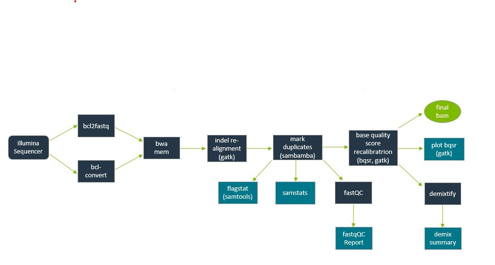

Items in teal are for *interpretation*. Items in dark blue are programs and tools. The final result (bam) is depicted in green.

# Step 1
## Quick references
-   for a list of tools, terms and definitions.

## The flow
In words:
-  Raw BCL data (Illumina sequencer) are demultiplex (converted to fastq) by
   -  bcl2fastq (MiSeq, NovaSeq, HiSeq...) **OR**
   -  bcl-convert (NextSeq, ...)
      -  Which is chosen depends on the format of the SampleSheet.
-  In either case, Tapir will demultiple
   -  Samples (per lane) **AND**
   -  Indexes (ie, indexes without an accompanying sample; useful for detecting carryover)
-  All fastqs are aligned using BWA mem.
   - One bam per lane per sample/index
-  A per-sample BAM is created
   -  indels are realigned (gatk)
   -  Input:  1+ bams
   -  Output: 1 bam
-  Duplicates are marked (sambamba) and the following summaries are made:
   -  Flagstat (per-read summary statistics)
   -  Samstats (per-site summary statistics)
   -  Fastqc is run
      -  And it's report is created
-  Base quality scores are empirically recalibrated (BQSR)
   -  The results are tabulated/plottted (plot_bqsr)
   -  And the same is tested to see if it is a mixture (Demixtify)
      -  Which generates both a detailed report (.demix) AND
      -  a summary
-  The final bam has been left-aligned around indels (.la), duplicates have been marked (.md), and BQSR has been applied (.bqsr).
