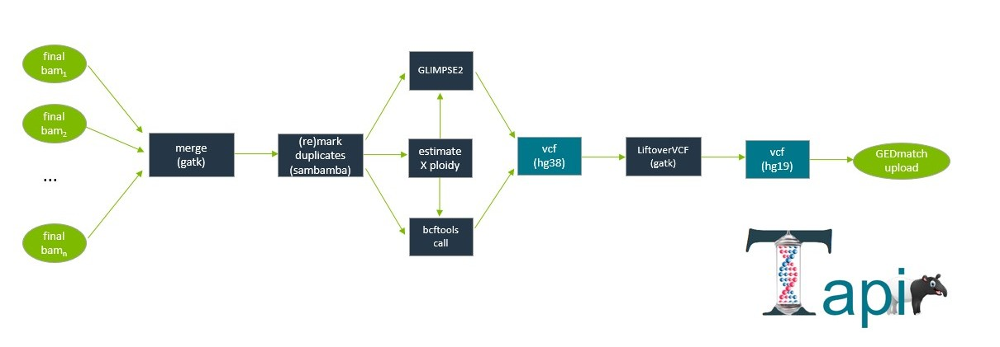

Items in teal are for *user-interpretation*. Items in dark blue are programs and tools. The final result (bam) is depicted in green.

# Step 2
## Quick references
-  [Click here](Glossary.md) for a list of tools, terms and definitions.

## Before you start
In words:
- In **Step 1**, we took our raw BCLs 
   -  n>=1 samples
- and made *n* + 2 (+ Offtargets and Undetermined) directories
   -  with processed bam files
      -  .la.md.bqsr.bam
	     - left-align (indel realignment)
		 - mark-duplicates (pcr/optical duplicates marked)
		 - bqsr (base-quality scores have been empirically recalibrated)
-  You might found that:
   -  at least 0.10× Coverage is needed
      - for Glimpse (imputation)
   -  and 5-10× Coverage is needed
      -  for BCFtools (maximum likelihood; no imputation)
-   Likewise, mixture fractions <10% (idealing <1%) are highly recommended
-   **The above thresholds should be vetted internally and modified as needed.**

In **Step 2** you select *one* of the *n* samples		 
-  You've completed **Step 1**
   - Checked the [QC](QC.md)
     - of each BAM
   -  And it passes *your labs* quality metrics

## The flow
Within a biological sample (with *m* libraries)
-  Composed of *m* measurements (bams)
   -  bams are merged (GATK)
      -  per-bam read-group information ensures a correct merger. [Click here](PowerUsers.md) for an explanation.
   -  duplicates are re-marked
      -  in case the same library was sequenced (at least) twice.
   -  Tapir optimizes the common case (m=1)
      - symbolic links when only 1 bam file is available; no merging, no PCR duplicate remarking.
-  Autosomal genotyping is performed using
   -  BCFtools (AND/)OR
   -  GLIMPSE
      -  Which tool depends on the user
-  The ploidy of the X chromosome (X vs XX hypothesis) is estimated
   -  Ploidy-aware genotyping is performed on the X
   -  And the results are merged with the autosomal data
-  The resulting VCF file 
   - hg38 reference genome
-  is converted to hg19 
   - LiftoverVCF
-  and a "23andme" file is made.
   -  uses Tapir's `bcf223andme.py` script
   -  applies threshold embedded in the `config.yaml` file
      - By default: 
	     - BCFtools: Genotype quality >20
		 - Glimpse: Genotype posterior probability >0.99 AND a Bayes Factor > 1.7
		 
		 
### Examples (FASTQ)

We run step2 of Tapir on those files that pass QC from step1. <br>
If we consider our example from [Step1]("./Step1.md"), a `LowPass` directory was made (that was our "Experiment name"; adjust as necessary).
```
ls LowPass/Sample_Data/GMWOF5428715/fastq_example/
```
`GMWOF5428715` is the name of the sample (from the SampleSheet); `fastq_example` is the name of the "run" (quotes, because it's just the name of the directory that housed the original fastqs)
Note that Tapir provides Bams and Reports for each sample for each run.

This provides:
```
Reports/
Logs/
Bams/
```
Where `Reports/` provides information on coverage (`.cov`), read mapping (`.flagstat`), the extent of BQSR recalibration (`.bqsr_summary.pdf`), the mixture status (`.demix.summary`), as well as two FASTQC reports (`.r_1.fastqc.html` and `.r_2.fastqc.html` for reads 1 and 2, respectively; merged across lanes).
<br>
`Bams/` provides what we care about; the final BAM file (`.la.md.bqsr.bam`)


After QC checking has been performed, run the next step2; first change into the right directory (the *Sample* directory. GMWOF5428715 in the above.


```
cd LowPass/Sample_Data/GMWOF5428715
```
And run snakemake:

on a commodity computer as:

```
snakemake -n -c 3 -s $TAPIR/snakemakes/bams2genotypes.smk --configfile $TAPIR/configs/config_v_2_low_mem.yaml 
```
(and remove the -n if the above looks right).
By default, Tapir runs both GLIMPSE and BCFtools. In my experience, BCFtools has limited applicability in low-throughput settings. Said plainly, it's hard to get a 5-10x genome out of a challenged sample. That said, what is "enough" data depends a lot on the question asked. You can save yourself some time by only running GLIMPSE:


```
snakemake -n -c 3 -s $TAPIR/snakemakes/bams2genotypes.smk --configfile $TAPIR/configs/config_v_2_low_mem.yaml --until call_glimpse2
```

(omitting the -n if you are happy with the result)

Only using 3 cores is very limiting; GLIMPSE is memory intensive, however. 3 works on my laptop, but consider ramping this value up if you have more memory.
## Genotyping everything

Sometimes it's useful to run *every* sample through step 2 (validation study, anyone?) <br>

From the `Sample_Data` (sub)directory, you can do the following:

```
for dir in `ls -d1 */ | egrep -v 'Undetermined|Offtargets|gtcommands'`;
do
echo "snakemake -d $dir -c 16 -s $TAPIR/snakemakes/bams2genotypes.smk";
done > gtcommands
```

Which will make a text file `gtcommands`; each line in it is a separate unix command that will genotype some sample. <br><br>
In gory detail, `ls -d1` lists all files, treating directories as files (note that's a one (1) not an el (l) ). The egrep command will remove the names in the pattern shown (we don't want to genotype the Undetermined data), and then we `echo` (unix-speak, print) the unix command we'd like to run on each directory we find. Feel free to change the `-c 16` to an appropriate value for your system. <br>
You can genotype all samples in parallel using:

```
parallel -j 10 < gtcommands &> gtcommands.outerr &
```

This will genotype up to 10 samples at a time, using no more than 10 (`-j 10`) x 16 (`-c 16`)=160 CPUs, which is fine for a moderately provisioned server (maybe 60+ CPUs?). On my laptop I'd use `-c 3` and `-j 1`, as that's a bit bareboned. Please pick a value that's appropriate for your system (noting that not all parts of the genotyping module support multi-processing, though snakemake will multitask things, so you get some multicore support). IE, its faster to do 10 x 16 than it is to do 1 x 160 ).
